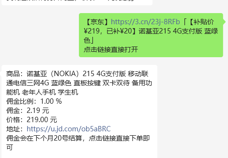
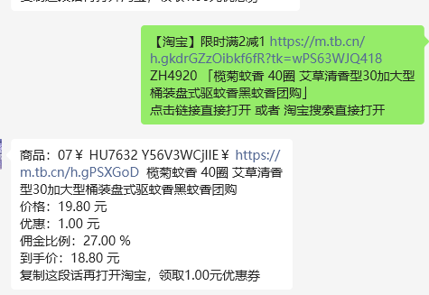

# rebateBot
# 返利机器人

## 说明
返利机器人是一款便捷的微信工具，帮助用户轻松获取购物返利。
- rebateBot----Linux下编译执行文件
- rebateBot.exe---win10及以上版本执行文件
- PS---win10以下版本下一个大版本准备支持

## 部署说明
  先下载rebateBot config.yaml文件在同一个文件夹下，并且修改config.yaml为你申请密钥，然后运行exe文件，在弹出浏览器页面登陆你的返利机器人微信号。
## 使用说明
1. **添加机器人**：
   - 在微信中搜索并添加返利机器人为好友。

2. **发送链接**：
   - 复制京东或淘宝的商品链接，直接粘贴并发送给机器人。

3. **获取返利链接**：
   - 机器人会自动转换链接，并回复一个返利链接。

4. **完成购买**：
   - 点击返回的链接，完成购物。

5. **佣金计算**：
   - 购物完成后，机器人会自动计算佣金，并通知您返利金额。

## 享受购物优惠
通过这一创新工具，您可以轻松享受网购优惠，提升购物体验。立即试用，开启您的智能购物返利之旅！

